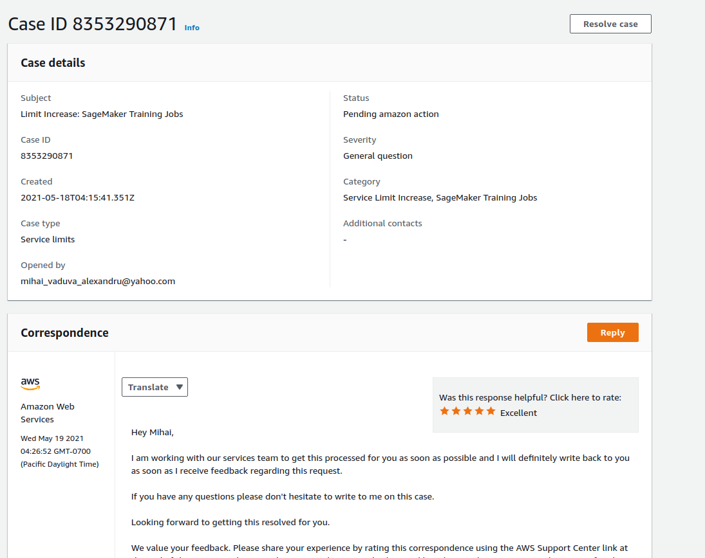
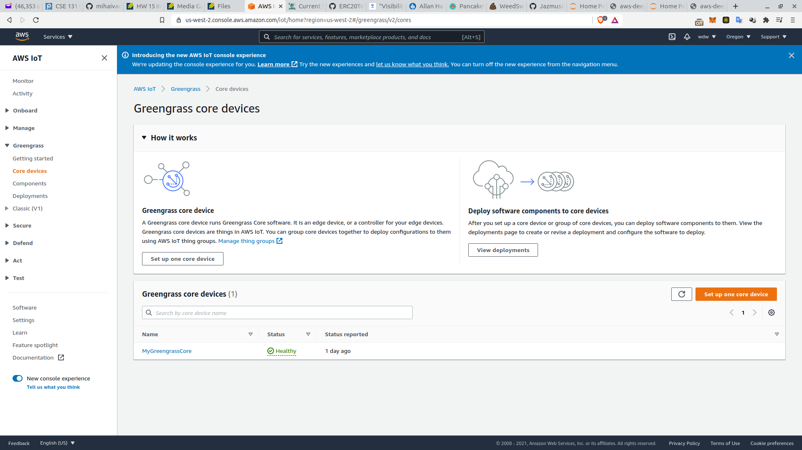
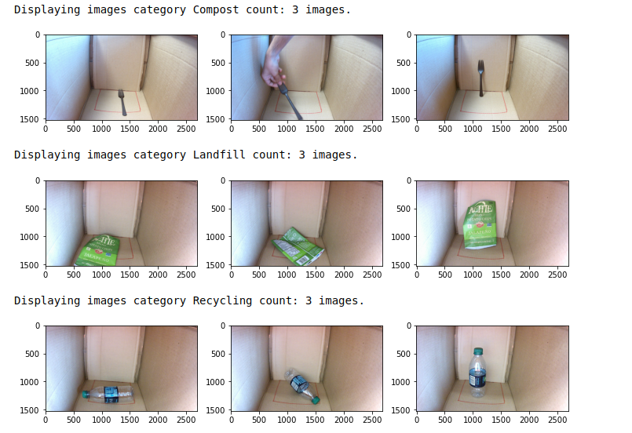

# Check-in

Date: 5-19-2021

## Jasmine

## Julia

## Mihai
- I just pushed to Github the model we will be running on AWS, you can check it out and deploy it on your own AWS console.

- I am waiting on AWS to approve some resources so we could train our model, the case is waiting confirmation from the team. I attached a picture of it.

- I deployed AWS IoT on the Pi as well and it shows on the Dashboard. 

- I attached some pictures with some of the test data, the amazon pending case and the AWS IoT working.

- uploaded a video on the drive called lobe on the demo folder. The Lobe Model is pretty accurate and we can import it straight on the pi so it might be a more memory intensive method but might do the job. I'll let you know further updates as soon as I update the model on the pi.

## Steven

## Yilin