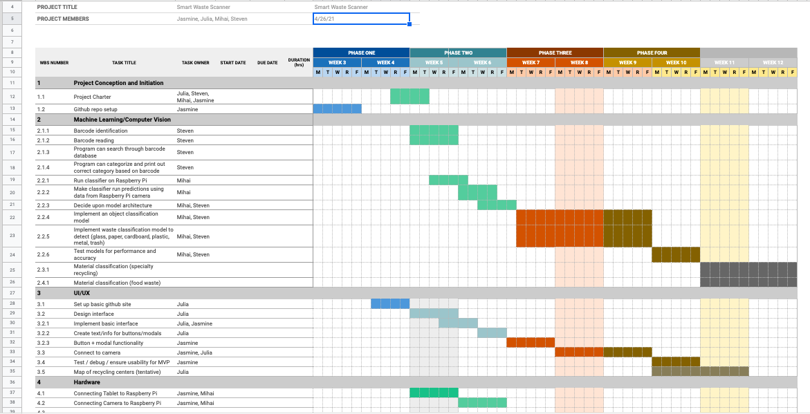

# Project Milestones and Schedule 

### Milestones
[Gantt Chart](https://docs.google.com/spreadsheets/d/1hELHBSfVzhgVlQ-FRjqm1UXFKXBpGtuc2WCGuSOQzQU/edit?usp=sharing)

* Connect hardware together
  * Raspberry Pi home screen is visible on the touchscreen - Jasmine + Mihai
  * Can see what’s on the camera on the touchscreen - Jasmine + Mihai
* Barcodes
  * Camera can identify barcode - Steven
  * Camera can read barcode - Steven
  * Program can search through barcode database - Steven + Yilin
  * Program can categorize and print out correct category based on barcode - Steven + Yilin
UI/UX
  * Set up basic github site (milestone) - Julia
We’ll know this component is complete when we have a Github page that we can access with a url similar to “http://smartwaste.github.io/” that has “hello world” printed on the front page
  * Design interface of app (milestone) - Julia + Yilin
We’ll know this part is complete when we have a figma design of our interface, complete with all the components we’d like to have (buttons, pop ups, waste classification)
  * Implement basic interface (deliverable) - Julia + Jasmine
We’ll know this part is complete when we have correct classification of our waste displayed on screen (or at a minimum the classification given by the model, even if it still needs tuning) as well as buttons for pop ups of additional information.
    * Includes displaying correct categories - Jasmine
    * Buttons for info / pop up modals connected to buttons + exits - Julia + Yilin
  * Connecting camera feed (milestone + deliverable) - Julia + Jasmine
We’ll know this part is complete when the image captured by the camera is displayed on the website.
  * Testing (milestone) - Jasmine + Yilin
We’ll know this part is complete when all of our tests have been run successfully.
  * Map (deliverable, tentative) - Julia + Yilin
We’ll know this part is complete when there is a feature to see special waste sites on our website.
* Object classification using machine learning
  * Run the classifier on the Raspberry Pi. - Mihai 
  * Make the classifier run the predictions using data from the Raspberry Pi Camera. - Mihai 
  * Decide upon model architecture - Mihai + Steven
  * Implement an object classification model - Mihai + Steven
    * Common items
      * Paper
      * Water bottle
      * Can
      * Glass bottle
    * Some specialty recyclables
      * Pencil/pen
      * Contact lens case
      * Batteries 
    * Some organic waste
      * Newspaper
      * Banana peel
  * Implement a waste classification model to detect the following classes.  : Glass, Paper, Cardboard, Plastic, Metal, Trash. - Mihai + Steven
  * Test our models performance and accuracy. 
